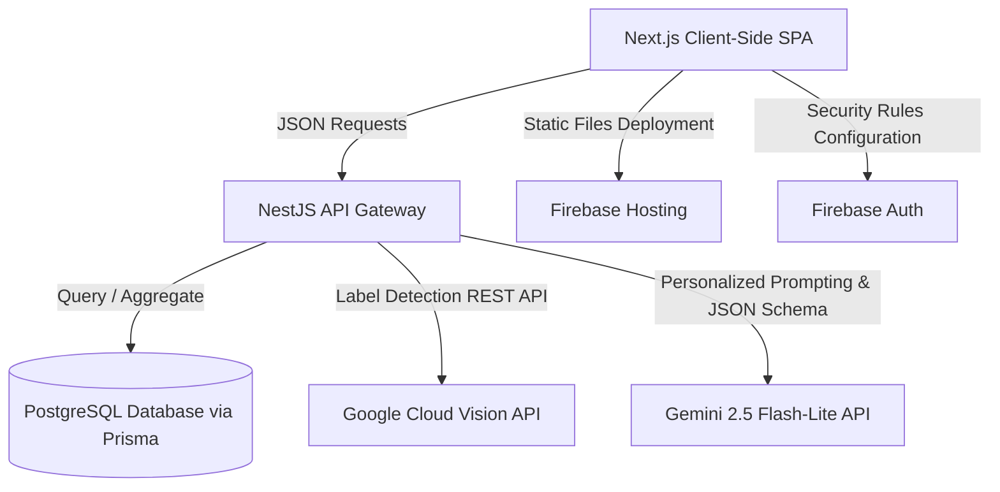

# 🌿 CarbonCoach AI — Smart Carbon Tracker & Sustainability Platform

> **Live Demo:** [https://carboncoach-ai-pro.web.app](https://carboncoach-ai-pro.web.app)  
> **Backend Repository:** Included in this monorepo under `/carbon-coach-backend`

---

## 🏆 The Hackathon Pitch

**CarbonCoach AI** is an intelligent, gamified platform designed to help individuals transition from climate awareness to climate action. 

While most carbon trackers are tedious spreadsheets requiring manual data entry, **CarbonCoach AI** leverages **Generative AI** and **Computer Vision** to make carbon tracking effortless, engaging, and highly personalized. By combining a **Gemini 2.5 Flash-Lite Chatbot**, **Google Cloud Vision API image scanning**, and **game mechanics** (XP, levels, streaks, and community leaderboards), CarbonCoach AI transforms sustainability into an interactive daily habit.

---

## ✨ Core Features

### 1. 📊 Eco-Metrics Dashboard
- **Dynamic Scoring:** Tracks annual carbon footprints (Tons CO₂/yr) and monthly emissions (kg CO₂) calculated dynamically from user habits.
- **Interactive Visualizations:** Built-in charts (using Recharts) display carbon breakdowns by category (Transport, Energy, Food, Shopping, Waste) and historical emission trends over daily, weekly, or monthly timeframes.
- **AI Recommendation Stream:** Real-time, actionable alerts suggesting specific ways to optimize your lifestyle footprint.

### 2. 💬 AI Chatbot & Sustainability Coach
- Powered by **Gemini 2.5 Flash-Lite** via the `@google/genai` SDK.
- **Habit-Aware Context:** Feeds the user's specific carbon-affecting profile (e.g. fuel type, travel distance, recycling behavior) into the model's system instructions for hyper-personalized advice.
- **Conversational Memory:** Preserves past message history to provide logical, context-aware follow-ups.

### 3. 📸 Carbon Impact Camera (Vision Scanner)
- **Object Recognition:** Integrates the **Google Cloud Vision API** to annotate scanned images of meals, appliances, or vehicles.
- **Structured CO₂ Mapping:** Passes labels to Gemini using strict **JSON schemas (Structured Outputs)** to estimate the item's CO₂ footprint and propose a green alternative (e.g. scanning a beef burger suggests a Beyond Plant Burger, saving ~4.2kg CO₂).
- **Gamified Rewards:** Awarding +20 Green Points and +50 XP for every scan.

### 4. 🎮 Gamified Eco-Challenges & Rewards
- **Challenges:** Participate in structured actions (e.g., "No Car Week", "Plant-Based Week") with progress trackers and rewards.
- **XP & Levels:** Level up as you build green habits and streaks.
- **Redeemable Rewards:** Redeem earned Green Points for real-world impact initiatives, such as planting trees (partnered with One Tree Planted) or funding ocean cleanups.

### 5. 👥 Community Leaderboard
- Compete with other users in a global leaderboard to drive community-driven sustainability.

---

## 🏗️ Architecture & Tech Stack



### Frontend
- **Framework:** Next.js 16 (compiled with Turbopack for lightning-fast speeds)
- **Styling:** Vanilla Tailwind CSS v4 & custom glassmorphism components
- **State Management:** Custom React Context API (`AppContext.tsx`)
- **Animations:** Framer Motion for smooth animations and transitions
- **Charts:** Recharts for responsive vector data graphs

### Backend
- **Framework:** NestJS (NodeJS Enterprise Web Framework)
- **ORM:** Prisma
- **Database:** PostgreSQL
- **AI Libraries:** `@google/genai` (Official Google AI Studio SDK)

---

## 🚀 Setup & Installation

### Frontend Setup
1. Clone the repository and navigate to the project root.
2. Install dependencies:
   ```bash
   npm install
   ```
3. Run the Next.js development server:
   ```bash
   npm run dev
   ```

### Backend Setup
1. Navigate to `/carbon-coach-backend`.
2. Install backend dependencies:
   ```bash
   npm install
   ```
3. Configure your `.env` file with the following variables:
   ```env
   DATABASE_URL="your-postgresql-connection-string"
   JWT_SECRET="your-jwt-secret"
   JWT_REFRESH_SECRET="your-jwt-refresh-secret"
   GEMINI_API_KEY="your-gemini-api-key"
   GEMINI_MODEL="gemini-2.5-flash-lite"
   VISION_API_KEY="your-google-cloud-vision-api-key"
   ```
4. Run database migrations:
   ```bash
   npx prisma db push
   ```
5. Start NestJS in watch mode:
   ```bash
   npm run start:dev
   ```

---

## 📦 Deployment

The frontend is deployed on **Firebase Hosting** with **Firebase Auth** configurations enabled.

To deploy a static HTML export:
1. Verify the project build setting in `next.config.ts`:
   ```typescript
   output: "export"
   ```
2. Build the Next.js project:
   ```bash
   npm run build
   ```
3. Select your active Firebase project and deploy:
   ```bash
   npx firebase-tools use carboncoach-ai-pro
   npx firebase-tools deploy
   ```

---

## 📜 License
Distributed under the MIT License. See `LICENSE` for more information.
